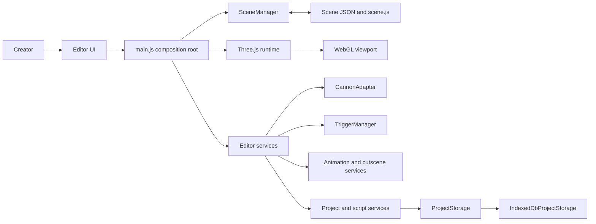
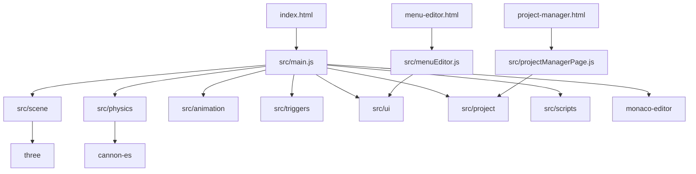
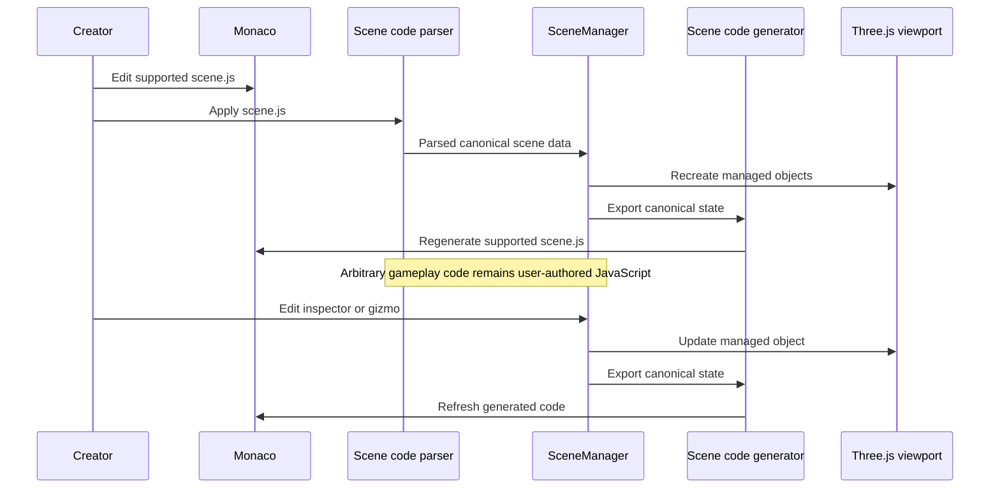
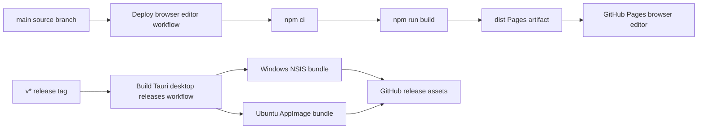
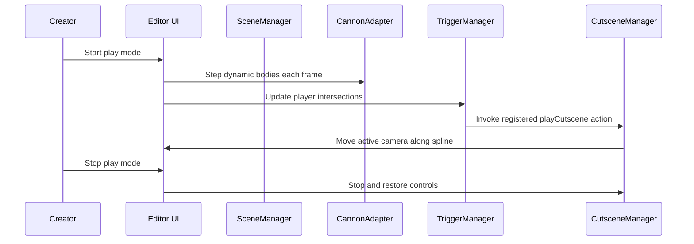

# 3ditorJS Architecture Reference

## Purpose and boundaries

3ditorJS is a browser-first Three.js scene editor. It combines a WebGL visual editor with code and JSON authoring tools, then packages the same frontend into a Tauri desktop shell. Modern ES modules and plain JavaScript are used throughout the editor core.

The product has three entry pages:

- `index.html`: the main scene editor.
- `menu-editor.html`: the optional, code-first menu editor.
- `project-manager.html`: the browser project manager.

Three.js is the rendering and scene foundation. Cannon-es physics, trigger zones, cutscenes, UI menus, scripts, and project persistence are adjacent services. They do not replace the Three.js scene model.

## Authoring model

Canonical Scene JSON is the structured bridge between the visual editor, persistence, and generated code. `scene.js` remains the main creative Three.js surface for supported scene declarations. Inspector, scene-tree, and transform-gizmo edits mutate canonical state and regenerate supported code. Applying `scene.js` parses only the conservative supported subset.

Custom gameplay, asset loading, shader helper logic, and other arbitrary JavaScript remain authored JavaScript. They are intentionally not flattened into the canonical JSON format.

## 4+1 Architectural View

The following diagrams use the 4+1 model: four structural views, followed by a scenario view that demonstrates the runtime collaboration between those structures.

### 1. Logical view

This view describes the product responsibilities and their primary dependencies.

`src/main.js` is the composition root. It creates the Three.js scene, renderer, camera and controls, wires UI events, and coordinates all services. `SceneManager` owns managed objects, canonical scene state, scene registration, and undo/redo history. The browser uses `IndexedDbProjectStorage`; File System Access and Tauri storage adapters are planned but not implemented.

### 2. Development view

This view maps the source modules and page entry points.

| Module | Responsibility |
| --- | --- |
| `src/scene` | Schema validation, canonical scene lifecycle, generated code, and conservative code parsing. |
| `src/physics` | Physics facade and Cannon-es adapter for bodies, colliders, impulses, grabs, and stepping. |
| `src/triggers` | Trigger registration, helper rendering, AABB overlap detection, events, and named actions. |
| `src/animation` | Three.js animation mixer wrapper, spline manipulation, and camera cutscene playback. |
| `src/project` | Virtual project file registry, project storage contract, and IndexedDB implementation. |
| `src/scripts` | Script listing and object attachment metadata. |
| `src/ui` | Optional DOM menu runtime API. |
| `src/main.js` | Editor orchestration, viewport interaction, inspectors, Monaco views, save/load, and play mode. |

## Runtime services

### Scene and code synchronization

`SceneManager` loads validated scene JSON into Three.js meshes and exports transform changes back to canonical state. `sceneCodeGenerator.js` emits supported Three.js, Cannon-es, trigger, spline, cutscene, shader, material, camera, and script declarations. `sceneCodeParser.js` recognizes generated supported constructs; it is not a general JavaScript parser.

### Physics and triggers

The active physics implementation is `CannonAdapter`. It maps a Three.js mesh to a Cannon body and supports box, sphere, cylinder, and capsule-style compound colliders. Dynamic bodies copy simulated position and rotation to their meshes after each physics step. The editor can temporarily make a dynamic body kinematic during gizmo dragging, then restore it on release.

`TriggerManager` stores trigger metadata, creates optional wireframe helpers, and checks actor bounding boxes against trigger boxes. It emits `triggerEnter` and `triggerExit` events and can invoke named registered actions such as a cutscene start.

### Animation, splines, and cutscenes

`AnimationManager` wraps Three.js `AnimationMixer`. `SplineEditor` owns editable Catmull-Rom control points and a single point gizmo. `CutsceneManager` moves the selected camera along a registered spline and exposes play, pause, and stop controls.

### Materials, shaders, and assets

The editor supports built-in Three.js materials including Basic, Phong, Standard, Physical, ShaderMaterial, and RawShaderMaterial where the schema supports them. Shader source is represented as project files under `shaders/` and imported by generated code with Vite's `?raw` convention. GLTF and GLB import uses `GLTFLoader`.

### Projects, scripts, and menus

`ProjectManager` provides an in-memory virtual file registry with starter scene, script, shader, asset, animation, and menu locations. Its browser persistence adapter stores projects and files in IndexedDB. `ScriptManager` tracks object-to-script attachments; scripts are generated as imports and instances but are not a general script execution sandbox.

`UIManager` powers optional game menus. The menu editor is separate so scene editing does not require a menu. A scene without a registered menu is unaffected.

### Development and quality checks

| Command | Purpose |
| --- | --- |
| `npm install` | Install JavaScript dependencies. |
| `npm run dev` | Start the Vite development server. |
| `npm run build` | Produce and validate the production browser bundle. |
| `npm run start` | Preview the production bundle locally. |
| `npm run tauri:dev` | Run the desktop shell with Rust and platform prerequisites installed. |
| `npm run tauri:build` | Build local desktop bundles. |

## 4+1 Operational Views

### 3. Process view

The browser editor runs all interaction services in one frontend process. The runtime loop steps physics, syncs dynamic bodies to meshes, advances animations and cutscenes, evaluates trigger overlap, then renders the Three.js scene. Monaco code editing and IndexedDB persistence are asynchronous browser services coordinated by the editor.

### 4. Physical and deployment view

The browser artifact and desktop packages start from the same Vite build. Pages receives an uploaded `dist` artifact from `main`; native packages are created only from a `v*` tag.

GitHub Pages must be configured to use GitHub Actions as its deployment source. The Vite production base path is `/3ditorJS/`, so editor-page navigation must use relative paths such as `./project-manager.html`.

Tauri configuration lives in `src-tauri`. The desktop shell is present, but a native filesystem bridge is not yet wired into the shared `ProjectStorage` contract. See [DEPLOYMENT.md](DEPLOYMENT.md) for release steps and current workflow status.

### +1. Scenario view: trigger-driven cutscene

This scenario shows the principal gameplay-style path currently supported by the editor runtime.

## Current limits and planned work

- The code parser intentionally supports only editor-generated constructs, not arbitrary JavaScript.
- IndexedDB is the working project persistence backend. The project manager opens a selected browser project by passing its project ID to the editor URL.
- File System Access and Tauri filesystem adapters are planned behind `ProjectStorage`.
- Player scripts are scaffolded and attachable; general user-script lifecycle execution remains incomplete.
- Shader files, uniform controls, persistence, and preview diagnostics need further strengthening.
- The inspector supports the active editor schema but does not yet match full Three.js Editor parity.
- Collision impact visualization and a broad automated test suite are planned.
- Tauri desktop packages must be considered unverified until a tagged GitHub Actions release succeeds on both matrix platforms.

## Related documentation

- [HOW_TO_USE.md](HOW_TO_USE.md): editor workflows and authoring instructions.
- [DEPLOYMENT.md](DEPLOYMENT.md): GitHub Pages and desktop release procedures.
- [../IMPLEMENTATION_PLAN.md](../IMPLEMENTATION_PLAN.md): phased roadmap and acceptance criteria.