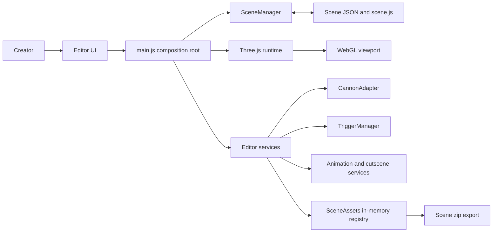
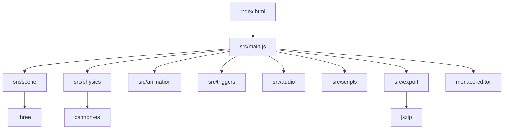
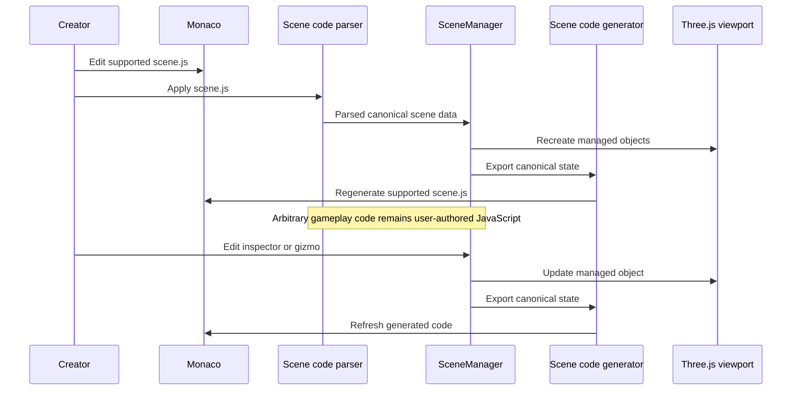
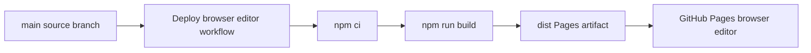
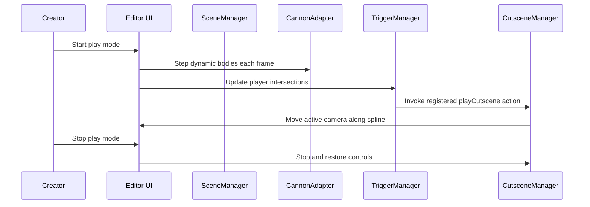

# 3ditorJS Architecture Reference

## Purpose and boundaries

3ditorJS is a browser-based Three.js scene and cutscene creator. It combines a WebGL visual editor with code and JSON authoring tools for a single in-memory scene, then exports that scene as a downloadable zip (`scene.js` plus its helper modules, scripts, shaders, and audio) for use in a regular Three.js project.

The product has a single entry page: `index.html`, the main scene editor.

Three.js is the rendering and scene foundation. Cannon-es physics, trigger zones, cutscenes, scripts, and audio are adjacent services. They do not replace the Three.js scene model.

## Authoring model

Canonical Scene JSON is the structured bridge between the visual editor, persistence, and generated code. `scene.js` remains the main creative Three.js surface for supported scene declarations. Inspector, scene-tree, and transform-gizmo edits mutate canonical state and regenerate supported code. Applying `scene.js` parses only the conservative supported subset.

Custom gameplay, asset loading, shader helper logic, and other arbitrary JavaScript remain authored JavaScript. They are intentionally not flattened into the canonical JSON format.

## 4+1 Architectural View

The following diagrams use the 4+1 model: four structural views, followed by a scenario view that demonstrates the runtime collaboration between those structures.

### 1. Logical view

This view describes the product responsibilities and their primary dependencies.

`src/main.js` is the composition root. It creates the Three.js scene, renderer, camera and controls, wires UI events, and coordinates all services. `SceneManager` owns the managed objects, canonical scene state, and undo/redo history for the single active scene. `SceneAssets` is an in-memory registry (no persistence) for scripts, shaders, and imported audio tied to the current editing session; it feeds the zip export.

### 2. Development view

This view maps the source modules and page entry points.

| Module | Responsibility |
| --- | --- |
| `src/scene` | Schema validation, canonical scene lifecycle, generated code, conservative code parsing, and the in-memory `SceneAssets` registry. |
| `src/physics` | Physics facade and Cannon-es adapter for bodies, colliders, impulses, grabs, and stepping. |
| `src/triggers` | Trigger registration, helper rendering, AABB overlap detection, events, and named actions. |
| `src/animation` | Three.js animation mixer wrapper, spline manipulation, and camera cutscene playback. |
| `src/audio` | BGM and SFX playback via `AudioManager`. |
| `src/scripts` | Script listing and object attachment metadata, backed by `SceneAssets`. |
| `src/export` | Builds the downloadable zip: `scene.js`, helper modules, scripts, shaders, and audio. |
| `src/main.js` | Editor orchestration, viewport interaction, inspectors, Monaco views, and scene export. |

## Runtime services

### Scene and code synchronization

`SceneManager` loads validated scene JSON into Three.js meshes and exports transform changes back to canonical state. `sceneCodeGenerator.js` emits supported Three.js, Cannon-es, trigger, spline, cutscene, shader, material, camera, and script declarations. `sceneCodeParser.js` recognizes generated supported constructs; it is not a general JavaScript parser.

### Physics and triggers

The active physics implementation is `CannonAdapter`. It maps a Three.js mesh to a Cannon body and supports box, sphere, cylinder, and capsule-style compound colliders, plus an arbitrary number of additional independently-shaped and independently-positioned "extra" colliders per body for compound shapes. A `collider: 'auto'` mode derives the shape and dimensions directly from the mesh's real (unscaled) bounding box, and colliders always rescale 1:1 with the object's `scale`. Dynamic bodies copy simulated position and rotation to their meshes after each physics step. The editor can temporarily make a dynamic body kinematic during gizmo dragging, then restore it on release.

When the "Physics colliders" display toggle is enabled, viewport clicks select the collider itself (not the mesh) and attach the transform gizmo directly to it for independent repositioning/resizing; right-clicking a physics-enabled object or one of its colliders opens a context menu to add or remove extra colliders, building up a compound shape. See [CONTROLS.md](CONTROLS.md) for the full interaction reference.

`TriggerManager` stores trigger metadata, creates optional wireframe helpers, and checks actor bounding boxes against box or sphere areas. It emits `triggerEnter` and `triggerExit` events and can invoke named registered actions such as a cutscene start. `SceneManager` owns canonical trigger records, while the Scene Tree and inspector create, select, configure, and delete those records.

### Animation, splines, and cutscenes

`AnimationManager` wraps Three.js `AnimationMixer`. `SplineEditor` owns editable Catmull-Rom control points and a single point gizmo. `CutsceneManager` moves the selected camera along a registered spline and exposes play, pause, and stop controls.

### Materials, shaders, and assets

The editor supports built-in Three.js materials including Basic, Phong, Standard, Physical, ShaderMaterial, and RawShaderMaterial where the schema supports them. Shader source is represented as project files under `shaders/` and imported by generated code with Vite's `?raw` convention. GLTF and GLB import uses `GLTFLoader`.

### Projects and scripts

`SceneAssets` is an in-memory registry for scripts, shaders, and imported audio tied to the current editing session; nothing is persisted between page loads. Folder-local creation actions add source files, while a file picker imports local audio into the session for use as BGM or SFX. `ScriptManager` tracks object-to-script attachments; scripts are generated as imports and instances but are not a general script execution sandbox.

### Scene export

`src/export/exportScene.js` builds a downloadable zip using JSZip. It writes `scene.js` (via the code generator), the `TriggerManager` helper module, and conditionally the `CutsceneManager` and `AudioManager` helper modules based on what the scene actually uses, plus any attached scripts, shader source, and imported audio referenced by the scene. Helper module source is embedded via Vite's `?raw` import so the exported code always matches the running editor version. A generated `README.txt` explains how to use the exported files in an external Three.js project.

### Development and quality checks

| Command | Purpose |
| --- | --- |
| `npm install` | Install JavaScript dependencies. |
| `npm run dev` | Start the Vite development server. |
| `npm run build` | Produce and validate the production browser bundle. |
| `npm run start` | Preview the production bundle locally. |
| `npm test` | Run the Node test suite (physics regression tests). |

## 4+1 Operational Views

### 3. Process view

The browser editor runs all interaction services in one frontend process, all scoped to a single in-memory scene. The runtime loop steps physics, syncs dynamic bodies to meshes, advances animations and cutscenes, evaluates trigger overlap, then renders the Three.js scene. Monaco code editing and the scene zip export are asynchronous browser services coordinated by the editor.

### 4. Physical and deployment view

The browser artifact is built with Vite and deployed to GitHub Pages from `main`.

GitHub Pages must be configured to use GitHub Actions as its deployment source. The Vite production base path is `/3ditorJS/`.

### +1. Scenario view: trigger-driven cutscene

This scenario shows the principal gameplay-style path currently supported by the editor runtime.

## Current limits and planned work

- The code parser intentionally supports only editor-generated constructs, not arbitrary JavaScript.
- The scene, scripts, shaders, and imported audio are in-memory only for the current browser session; there is no save/load or project persistence. Use **Download scene** to keep your work.
- Player scripts are scaffolded and attachable; general user-script lifecycle execution remains incomplete.
- Shader files, uniform controls, and preview diagnostics need further strengthening.
- The inspector supports the active editor schema but does not yet match full Three.js Editor parity.
- Collision impact visualization and a broad automated test suite are planned.
- A prior iteration of this project targeted a multi-scene project browser and a Tauri desktop shell; that work is preserved on the `game-engine-full` branch and is out of scope for the current vision.

## Related documentation

- [HOW_TO_USE.md](HOW_TO_USE.md): editor workflows and authoring instructions.
- [DEPLOYMENT.md](DEPLOYMENT.md): GitHub Pages deployment procedures.
- [../IMPLEMENTATION_PLAN.md](../IMPLEMENTATION_PLAN.md): phased roadmap and acceptance criteria.